# 图形

> 原文：[https://rpy2.readthedocs.io/en/version_2.8.x/graphics.html](https://rpy2.readthedocs.io/en/version_2.8.x/graphics.html)

## 介绍

本节介绍如何使用 R 用户可用的一些不同图形系统，从 RPY2 生成 R 图形。

本节的目的是让用户去，并能够通过阅读 R 文档了解如何在 RPY2 中执行相同的绘图。

### 图形设备

使用`R`将所有图形绘制到所谓的图形设备中。图形设备可以是交互式的，例如`X11`，也可以是非交互式的，例如`png`或`pdf`。非交互式设备似乎是文件。可以从 python/rpy2 创建自定义图形设备，但这是一个高级主题（请参见[自定义图形设备](graphicaldevices.html#graphicaldevices-custom)）。

默认情况下，交互式 R 会话将在需要时打开交互式设备。如果需要非交互式图形设备，必须指定它。

注意

完成后不要忘记关闭非交互式设备。这可能需要从缓冲区中刷新挂起的数据。

模块`grdevices`旨在表示 R 包 grdevices*。带有 R 函数 _png_ 和 _dev.off_ 的示例：

```
from rpy2.robjects.packages import importr
grdevices = importr('grDevices')

grdevices.png(file="path/to/file.png", width=512, height=512)
# plotting code here
grdevices.dev_off()

```

该包包含一个`Environment``grdevices_env`可用于访问已知属于该 R 包的对象，例如：

```
>>> palette = grdevices.palette()
>>> print(palette)
[1] "black"   "red"     "green3"  "blue"    "cyan"    "magenta" "yellow"
[8] "gray"

```

### 准备好了

要运行本节中的示例，我们首先导入[`rpy2.robjects`](robjects.html#module-rpy2.robjects "rpy2.robjects: High-level interface with R (Unix, Windows)")并定义一些助手函数。

```
from rpy2 import robjects
from rpy2.robjects import Formula, Environment
from rpy2.robjects.vectors import IntVector, FloatVector
from rpy2.robjects.lib import grid
from rpy2.robjects.packages import importr, data
from rpy2.rinterface import RRuntimeError
import warnings

# The R 'print' function
rprint = robjects.globalenv.get("print")
stats = importr('stats')
grdevices = importr('grDevices')
base = importr('base')
datasets = importr('datasets')

grid.activate()

```

## 包 _ 格子 _

### 介绍

导入包`lattice`的操作与导入其他 r 包的操作相同。

```
lattice = importr('lattice')

```

### 散点图

我们使用数据集 _mtcars_，并使用点阵函数 _xyplot_ 绘制散点图。

```
xyplot = lattice.xyplot

```

Lattice 正在使用公式（参见[公式](robjects_formulae.html#robjects-formula)），因此我们构建一个公式并在其环境中存储值。绘制一个图就是用 _ 公式 _ 作为参数调用函数 _xyplot_。

```
datasets = importr('datasets')
mtcars = data(datasets).fetch('mtcars')['mtcars']
formula = Formula('mpg ~ wt')
formula.getenvironment()['mpg'] = mtcars.rx2('mpg')
formula.getenvironment()['wt'] = mtcars.rx2('wt')

p = lattice.xyplot(formula)
rprint(p)

```

[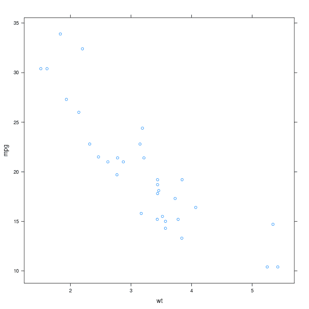](_images/graphics_lattice_xyplot_1.png)

只需使用命名参数组即可显示组信息。这将通过颜色编码指示不同的组。

```
p = lattice.xyplot(formula, groups = mtcars.rx2('cyl'))
rprint(p)

```

[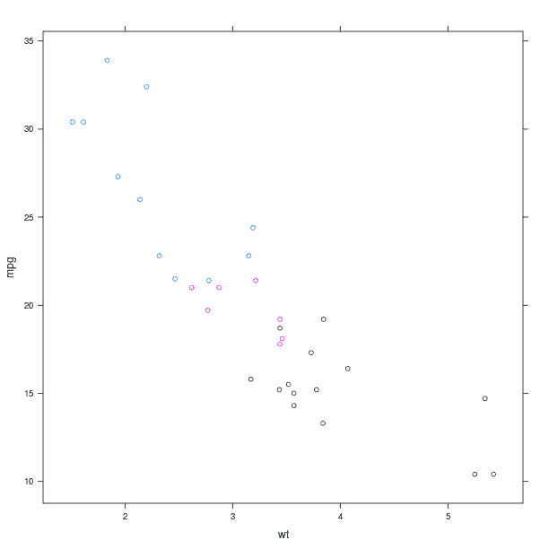](_images/graphics_lattice_xyplot_2.png)

颜色编码的另一种方法是使用不同的点 _ 面板 _。在晶格中，这是通过在公式中指定它来完成的。

```
formula = Formula('mpg ~ wt | cyl')
formula.getenvironment()['mpg'] = mtcars.rx2('mpg')
formula.getenvironment()['wt'] = mtcars.rx2('wt')
formula.getenvironment()['cyl'] = mtcars.rx2('cyl')

p = lattice.xyplot(formula, layout = IntVector((3, 1)))
rprint(p)

```

[](_images/graphics_lattice_xyplot_3.png)

### 方框图

```
p = lattice.bwplot(Formula('mpg ~ factor(cyl) | gear'),
                   data = mtcars, fill = 'grey')
rprint(p, nrow=1)

```

[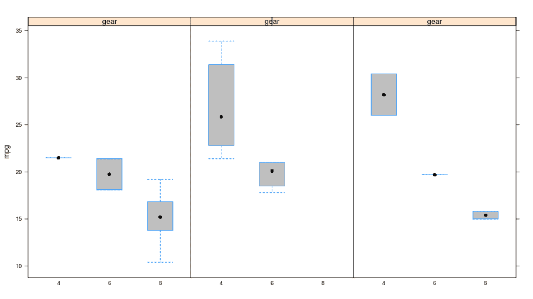](_images/graphics_lattice_bwplot_1.png)

### 其他地块

r package 晶格包含许多其他图，不幸的是，这些图不能全部在这里详述。

```
tmpenv = data(datasets).fetch("volcano")
volcano = tmpenv["volcano"]

p = lattice.wireframe(volcano, shade = True,
                      zlab = "",
                      aspect = FloatVector((61.0/87, 0.4)),
                      light_source = IntVector((10,0,10)))
rprint(p)

```

[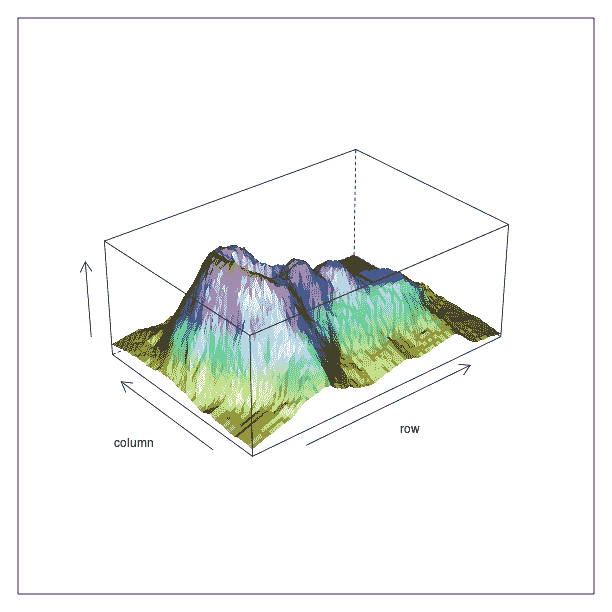](_images/graphics_lattice_wireframe_1.png)

也可以在公式中指定将信息拆分为不同的面板。这里我们展示了一个手工的例子，根据 z 轴上绘制的值进行分割。

```
reshape2 = importr('reshape2')
dataf = reshape2.melt(volcano)
dataf = dataf.cbind(ct = lattice.equal_count(dataf.rx2("value"), number=3, overlap=1/4))
p = lattice.wireframe(Formula('value ~ Var1 * Var2 | ct'), 
                      data = dataf, shade = True,
                      aspect = FloatVector((61.0/87, 0.4)),
                      light_source = IntVector((10,0,10)))
rprint(p, nrow = 1)

```

[](_images/graphics_lattice_wireframe_2.png)

## 包 _ggplot2_

### Introduction

r 包 _ggplot2_ 实现图形语法。虽然可以在[ggplot2 网站](http://had.co.nz/ggplot2/)上找到更多关于包及其与 r 的用法的文档，但本节将介绍构建图所需的基本概念。显然，_r_ 包 _ggplot2_ 预计安装在 _rpy2_ 使用的 _r_ 中。

该包使用的是 _ 网格 _ 底层绘图基础设施，可通过模块`rpy2.robjects.lib.grid`访问。当需要在同一设备上单独绘制，或覆盖任意图形元素，或需要大量的绘图自定义或编辑时，需要具备 _ 网格 _ 的一些知识。

这里同样需要在`DataFrame`中包含数据（有关此类对象的详细信息，请参见[数据框](vector.html#robjects-dataframes)）。

```
import math, datetime
import rpy2.robjects.lib.ggplot2 as ggplot2
import rpy2.robjects as ro
from rpy2.robjects.packages import importr
base = importr('base')

mtcars = data(datasets).fetch('mtcars')['mtcars']

```

```
rnorm = stats.rnorm
dataf_rnorm = robjects.DataFrame({'value': rnorm(300, mean=0) + rnorm(100, mean=3),
                                  'other_value': rnorm(300, mean=0) + rnorm(100, mean=3),
                                  'mean': IntVector([0, ]*300 + [3, ] * 100)})

```

### 绘图

```
gp = ggplot2.ggplot(mtcars)

pp = gp + \
     ggplot2.aes_string(x='wt', y='mpg') + \
     ggplot2.geom_point()

pp.plot()

```

[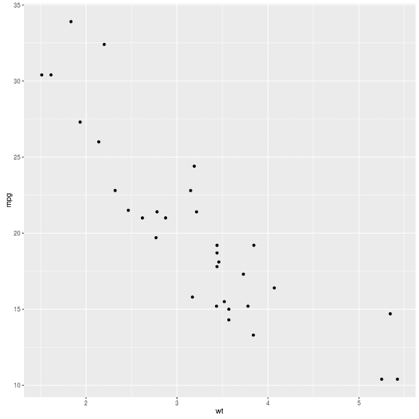](_images/graphics_ggplot2mtcars.png)

#### 审美映射

图形语法的一个重要概念是将变量或数据框架中的列映射到图形表示。

与为 _Lattice_ 显示的一样，第三个变量可以使用颜色编码在同一绘图上表示，现在可以通过将其指定为映射（调用`AesString`的构造函数时的参数 _col_ 来实现）。

```
gp = ggplot2.ggplot(mtcars)

pp = gp + \
     ggplot2.aes_string(x='wt', y='mpg', col='factor(cyl)') + \
     ggplot2.geom_point()

pp.plot()

```

[](_images/graphics_ggplot2mtcarscolcyl.png)

绘制的图形符号（此处为圆点）的大小也可以映射到变量：

```
pp = gp + \
     ggplot2.aes_string(x='wt', y='mpg', size='factor(carb)',
                 col='factor(cyl)', shape='factor(gear)') + \
     ggplot2.geom_point()

pp.plot()

```

[](_images/graphics_ggplot2aescolsize.png)

#### 几何图形

_ 几何图形 _ 是数据的表示方式。到目前为止，我们使用了点的散点图，但是还有其他方法来表示我们的数据。

观察单变量数据的分布可以通过直方图实现：

```
gp = ggplot2.ggplot(mtcars)

pp = gp + \
     ggplot2.aes_string(x='wt') + \
     ggplot2.geom_histogram()

#pp.plot()

```

[](_images/graphics_ggplot2geomhistogram.png)

```
gp = ggplot2.ggplot(mtcars)

pp = gp + \
     ggplot2.aes_string(x='wt', fill='factor(cyl)') + \
     ggplot2.geom_histogram()

pp.plot()

```

[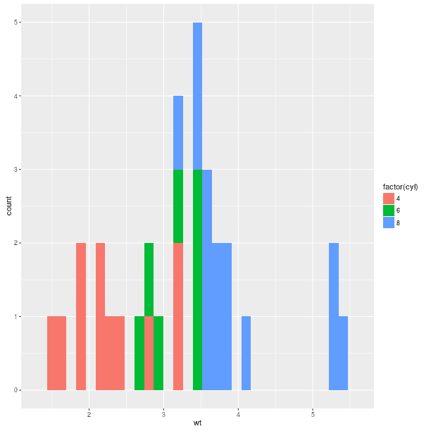](_images/graphics_ggplot2geomhistogramfillcyl.png)

同一图形上基于条形图的多个密度表示常常缺乏清晰度，基于线条的表示可能更好`geom_freqpoly()`（以虚线表示频率）或`geom_density()`（绘制密度估计）。

```
pp = gp + \
     ggplot2.aes_string(x='value', fill='factor(mean)') + \
     ggplot2.geom_density(alpha = 0.5)

```

[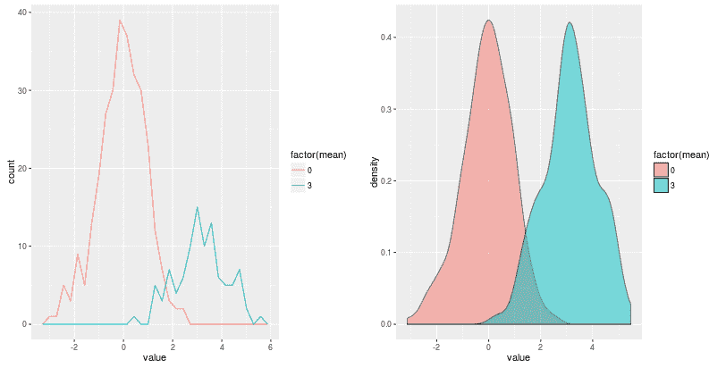](_images/graphics_ggplot2geomfreqpolyfillcyl.png)

每当出现大量的点时，表示散射图上“点”的密度就会变得有趣。

使用二维垃圾箱：

```
gp = ggplot2.ggplot(dataf_rnorm)

pp = gp + \
     ggplot2.aes_string(x='value', y='other_value') + \
     ggplot2.geom_bin2d() + \
     ggplot2.ggtitle('geom_bin2d')
pp.plot(vp = vp)

```

用核密度估算：

```
gp = ggplot2.ggplot(dataf_rnorm)

pp = gp + \
     ggplot2.aes_string(x='value', y='other_value') + \
     ggplot2.geom_density2d() + \
     ggplot2.ggtitle('geom_density2d')
pp.plot(vp = vp)

```

带六角形箱：

```
gp = ggplot2.ggplot(dataf_rnorm)

pp = gp + \
     ggplot2.aes_string(x='value', y='other_value') + \
     ggplot2.geom_hex() + \
     ggplot2.ggtitle('geom_hex')
pp.plot(vp = vp)

```

[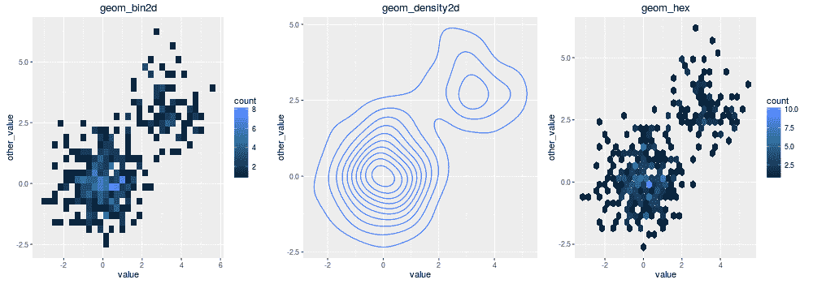](_images/graphics_ggplot2geombin2d.png)

方框图：

```
gp = ggplot2.ggplot(mtcars)

pp = gp + \
     ggplot2.aes_string(x='factor(cyl)', y='mpg') + \
     ggplot2.geom_boxplot()

pp.plot()

```

[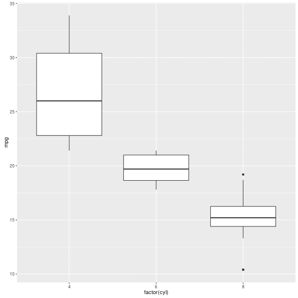](_images/graphics_ggplot2geomboxplot.png)

箱线图可以用来表示数据的 _ 摘要 _，重点是位置和排列。

```
gp = ggplot2.ggplot(mtcars)

pp = gp + \
     ggplot2.aes_string(x='factor(cyl)', y='mpg', fill='factor(cyl)') + \
     ggplot2.geom_boxplot()

pp.plot()

```

[](_images/graphics_ggplot2aescolboxplot.png)

与数据匹配的模型也很容易添加到绘图中：

```
pp = gp + \
     ggplot2.aes_string(x='wt', y='mpg') + \
     ggplot2.geom_point() + \
     ggplot2.stat_smooth(method = 'lm')
pp.plot()

```

[](_images/graphics_ggplot2addsmooth.png)

_ 方法 _ 可以是 _glm_、_gam_、_ 黄土 _、_rlm_ 之一，并且可以指定公式来声明拟合（参见下面的示例）。

[](_images/graphics_ggplot2addsmoothmethods.png)

`GeomSmooth`的构造函数还接受一个参数 _groupr_，该参数指示是否应根据组进行匹配。

```
pp = gp + \
     ggplot2.aes_string(x='wt', y='mpg') + \
     ggplot2.geom_point() + \
     ggplot2.geom_smooth(ggplot2.aes_string(group = 'cyl'),
                         method = 'lm')
pp.plot()

```

[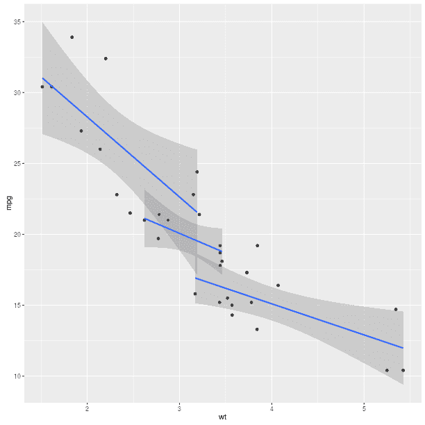](_images/graphics_ggplot2smoothbycyl.png)

对列 _cyl_ 中的信息进行编码只是在`AesString`映射中指定它的问题。

```
pp = ggplot2.ggplot(mtcars) + \
     ggplot2.aes_string(x='wt', y='mpg', col='factor(cyl)') + \
     ggplot2.geom_point() + \
     ggplot2.geom_smooth(ggplot2.aes_string(group = 'cyl'),
                         method = 'lm')
pp.plot()

```

[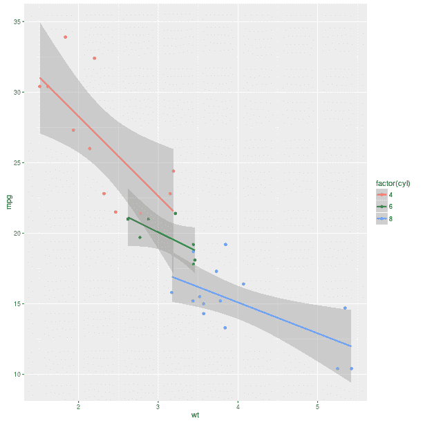](_images/graphics_ggplot2_smoothbycylwithcolours.png)

正如在使用`GeomSmooth`的示例中所观察到的，可以在彼此的顶部添加几个 _ 几何体 _ 对象，以创建最终绘图。例如，边缘 _ 地毯 _ 可以添加到规则散点图的轴上：

```
gp = ggplot2.ggplot(mtcars)

pp = gp + \
     ggplot2.aes_string(x='wt', y='mpg') + \
     ggplot2.geom_point() + \
     ggplot2.geom_rug()

pp.plot()

```

[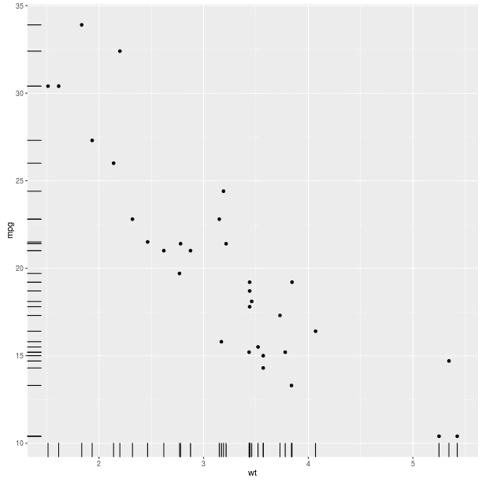](_images/graphics_ggplot2geompointandrug.png)

```
gp = ggplot2.ggplot(dataf_rnorm)

pp = gp + \
     ggplot2.aes_string(x='value', y='other_value') + \
     ggplot2.geom_point(alpha = 0.3) + \
     ggplot2.geom_density2d(ggplot2.aes_string(col = '..level..')) + \
     ggplot2.ggtitle('point + density')
pp.plot()

```

[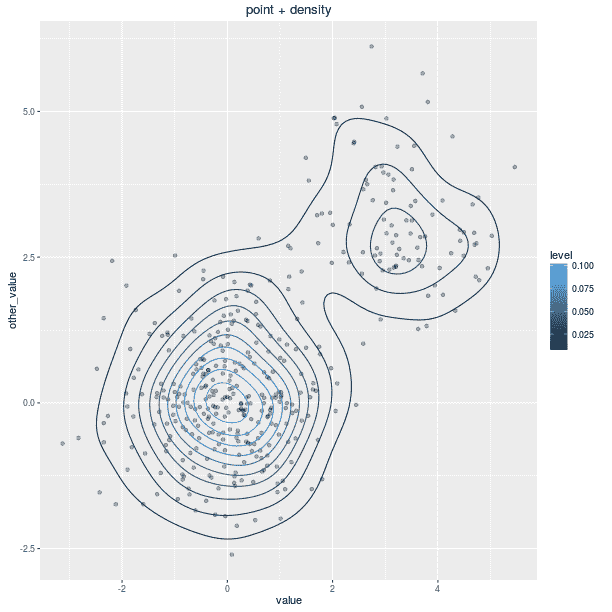](_images/graphics_ggplot2geompointdensity2d.png)

多边形可用于地图，如下面相对人工的示例所示：

```
map = importr('maps')
fr = ggplot2.map_data('france')

# add a column indicating which region names have an "o".
fr = fr.cbind(fr, has_o = base.grepl('o', fr.rx2("region"),
                                     ignore_case = True))
p = ggplot2.ggplot(fr) + \
    ggplot2.geom_polygon(ggplot2.aes_string(x = 'long', y = 'lat',
                                            group = 'group', fill = 'has_o'),
                         col="black")
p.plot()

```

[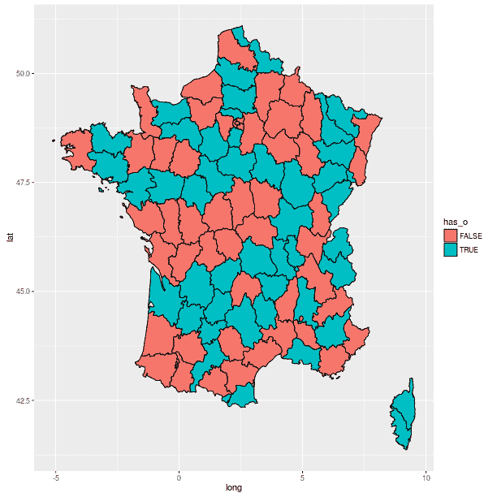](_images/graphics_ggplot2map_polygon.png)

#### 轴

轴可以以各种方式进行转换和配置。

常见的转换是坐标的对数转换。

```
from rpy2.robjects.lib import grid
grid.newpage()
grid.viewport(layout=grid.layout(2, 3)).push()

diamonds = ggplot2.ggplot2.__rdata__.fetch('diamonds')['diamonds']
gp = ggplot2.ggplot(diamonds)

for col_i, trans in enumerate(("identity", "log2", "sqrt")):
   # fetch viewport at position col_i+1 on the first row
   vp = grid.viewport(**{'layout.pos.col':col_i+1, 'layout.pos.row': 1})
   pp = gp + \
       ggplot2.aes_string(x='carat', y='price') + \
       ggplot2.geom_point(alpha = 0.1, size = 1) + \
       ggplot2.coord_trans(x = trans, y = trans) + \
       ggplot2.ggtitle("%s on axis" % trans)   
   # plot into the viewport
   pp.plot(vp = vp)

   # fetch viewport at position col_i+1 on the second row
   vp = grid.viewport(**{'layout.pos.col':col_i+1, 'layout.pos.row': 2})
   pp = gp + \
       ggplot2.aes_string(x='%s(carat)' % trans, y='%s(price)' % trans) + \
       ggplot2.geom_point(alpha = 0.1, size = 1) + \
       ggplot2.ggtitle("%s(<variable>)" % trans)   
   pp.plot(vp = vp)

```

[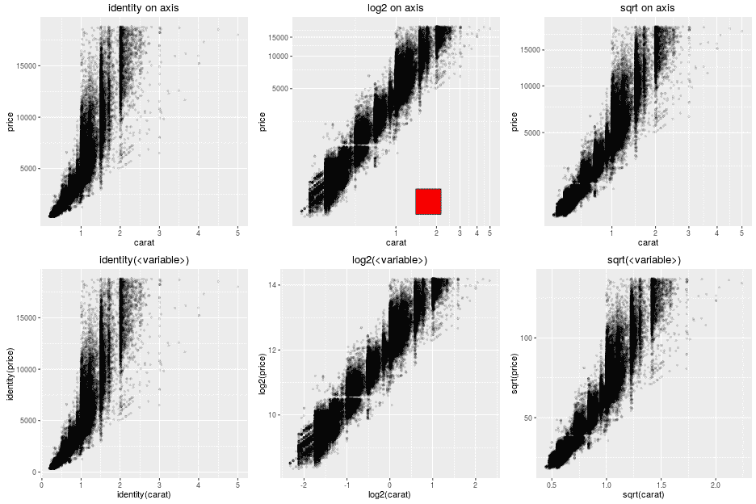](_images/graphics_ggplot2mtcars_coordtrans.png)

Note

红色方块是向 ggplot2 图形添加图形元素的示例。

```
vp = grid.viewport(**{'layout.pos.col':2, 'layout.pos.row': 1})
grid.rect(x = grid.unit(0.7, "npc"),
          y = grid.unit(0.2, "npc"),
          width = grid.unit(0.1, "npc"),
          height = grid.unit(0.1, "npc"),
          gp = grid.gpar(fill = "red"),
          vp = vp).draw()

```

#### 面

以类似于我们对 _lattice_ 所做的方式将数据拆分为面板，现在需要添加 _ 方面 _。_ggplot2_ 的一个核心概念是，绘图由添加的图形元素组成，然后添加诸如“我希望我的数据在面板中拆分”之类的规范就是将这些信息添加到现有绘图中。

例如，拆分列 _cyl_ 中数据上的绘图仍然只需添加一个`FacetGrid`即可完成。

```
pp = gp + \
     ggplot2.aes_string(x='wt', y='mpg') + \
     ggplot2.geom_point() + \
     ggplot2.facet_grid(ro.Formula('. ~ cyl')) + \
     ggplot2.geom_smooth(ggplot2.aes_string(group="cyl"),
                         method = "lm",
                            data = mtcars)

pp.plot()

```

[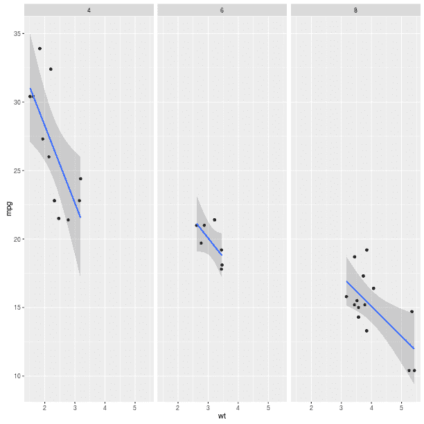](_images/graphics_ggplot2smoothbycylfacetcyl.png)

数据的表示方式（使用图形语法的术语中的 _ 几何图形 _ 仍然以通常的方式指定。

```
pp = gp + \
     ggplot2.aes_string(x='wt') + \
     ggplot2.geom_histogram(binwidth=2) + \
     ggplot2.facet_grid(ro.Formula('. ~ cyl'))

pp.plot()

```

[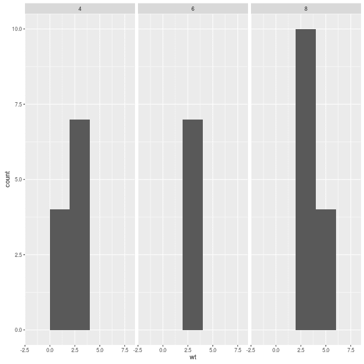](_images/graphics_ggplot2histogramfacetcyl.png)

```
pp = gp + \
     ggplot2.aes_string(x='wt', y='mpg') + \
     ggplot2.geom_point() + \
     ggplot2.geom_abline(intercept = 30)
pp.plot()

```

[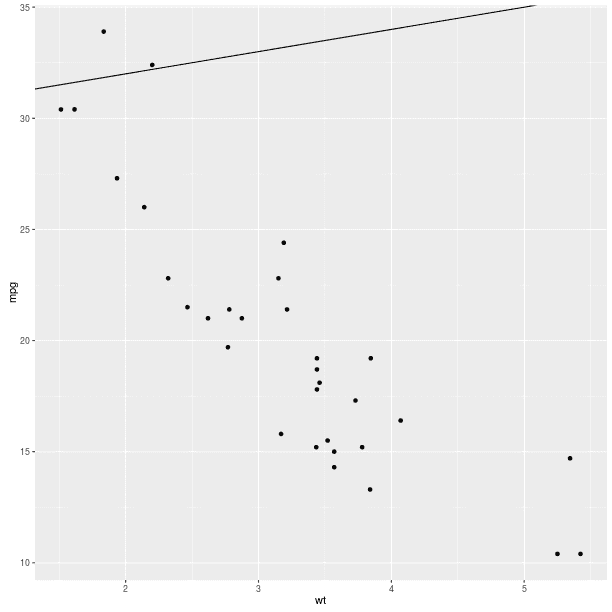](_images/graphics_ggplot2_qplot_4.png)

```
pp = gp + \
     ggplot2.aes_string(x='wt', y='mpg') + \
     ggplot2.geom_point() + \
     ggplot2.geom_abline(intercept = 30) + \
     ggplot2.geom_abline(intercept = 15)
pp.plot()

```

[](_images/graphics_ggplot2_qplot_5.png)

```
pp = gp + \
     ggplot2.aes_string(x='wt', y='mpg') + \
     ggplot2.geom_point() + \
     ggplot2.stat_smooth(method = 'lm', fill = 'blue',
                         color = 'red', size = 3)
pp.plot()

```

[](_images/graphics_ggplot2smoothblue.png)

```
pp = gp + \
     ggplot2.aes_string(x='wt', y='mpg') + \
     ggplot2.geom_point() + \
     ggplot2.stat_smooth(method = 'lm', fill = 'blue',
                         color = 'red', size = 3)
pp.plot()

```

[](_images/graphics_ggplot2smoothblue.png)

## 包 _ 网格 _

_grid_ 包是 _lattice_ 和 _ggplot2_ 图形的底层绘图环境。简言之，它包括将坐标系统（_ 视区 _）推送和弹出到堆栈中，并在其中绘制图形元素。系统可以被认为是一个场景图，其中每个 _ 视区 _ 都有一个节点。

```
>>> from rpy2.robjects.lib import grid

```

通过调用函数`grid.newpage()`来获取新页面。

调用`layout()`将创建一个布局，例如创建一个具有一行和三列的布局：

```
>>> lt = grid.layout(1, 3)

```

该布局可用于构建视区：

```
>>> vp = grid.viewport(layout = lt)

```

创建的视区对应于图形实体。推入当前视区，可以使用类方法`grid.Viewport.push()`完成：

```
>>> vp.push()

```

例子：

```
grid.newpage()
# create a rows/columns layout
lt = grid.layout(2, 3)
vp = grid.viewport(layout = lt)
# push it the plotting stack
vp.push()

# create a viewport located at (1,1) in the layout
vp = grid.viewport(**{'layout.pos.col':1, 'layout.pos.row': 1})
# create a (unit) rectangle in that viewport
grid.rect(vp = vp).draw()

vp = grid.viewport(**{'layout.pos.col':2, 'layout.pos.row': 2})
# create text in the viewport at (1,2)
grid.text("foo", vp = vp).draw()

vp = grid.viewport(**{'layout.pos.col':3, 'layout.pos.row': 1})
# create a (unit) circle in the viewport (1,3)
grid.circle(vp = vp).draw()

```

[](_images/graphics_grid.png)

### 带网格的自定义 ggplot2 布局

```
grid.newpage()

# create a viewport as the main plot
vp = grid.viewport(width = 1, height = 1) 
vp.push()

tmpenv = data(datasets).fetch("rock")
rock = tmpenv["rock"]

p = ggplot2.ggplot(rock) + \
    ggplot2.geom_point(ggplot2.aes_string(x = 'area', y = 'peri')) + \
    ggplot2.theme_bw()
p.plot(vp = vp)

vp = grid.viewport(width = 0.6, height = 0.6, x = 0.37, y=0.69)
vp.push()
p = ggplot2.ggplot(rock) + \
    ggplot2.geom_point(ggplot2.aes_string(x = 'area', y = 'shape')) + \
    ggplot2.theme(**{'axis.text.x': ggplot2.element_text(angle = 45)})

p.plot(vp = vp)

```

[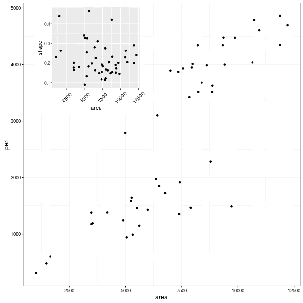](_images/graphics_ggplot2withgrid.png)

### 类

### 类图